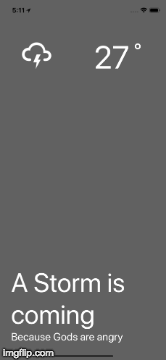

### React Native Weather App
---

This repo was created to begin to learn React Native. Through the development process I was able to expand my understanding of how React Native works as well as how powerful of a tool it is. 

## Technologies Used
- React Native
- Expo
- Node.js
- OpenWeather API

*This project is based on a tutorial by Aman Mittal which you can find [here](https://blog.expo.io/building-a-minimalist-weather-app-with-react-native-and-expo-fe7066e02c09)*
